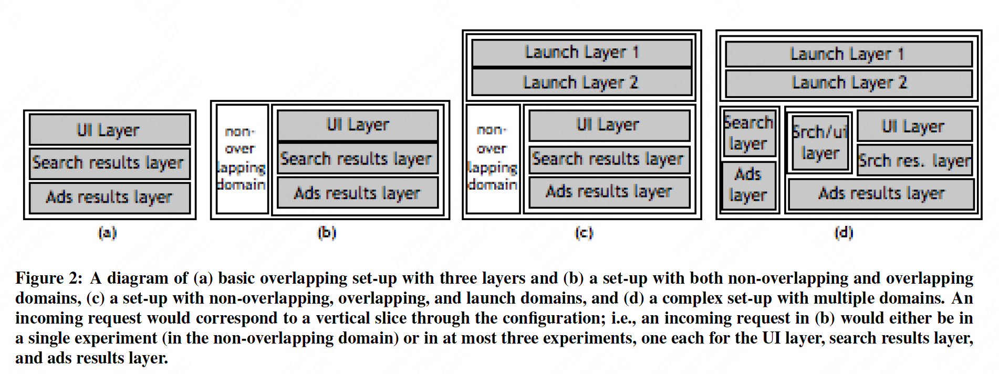
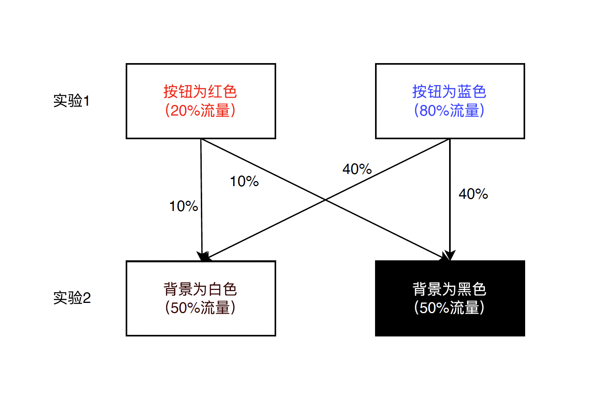

## 背景介绍
Overlapping Experiment Infrastructure: More, Better, Faster Experimentation 这篇论文是谷歌在 2010 年发表在 KDD’10 上的，关于 A/B 测试的论文。可以视作是互联网大规模 A/B 测试（之前的工作主要关注在 web-based experiment 和小规模）系统领域的开山之作。工业界无论是 ToB 的 A/B 测试产品，还是内部的 A/B 测试工具，都或多或少借鉴了这篇论文的思想。

- [谷歌Firebase A/B测试](https://firebase.google.com/docs/ab-testing/abtest-config)
- [美团到店测试平台](https://tech.meituan.com/2019/11/28/advertising-performance-experiment-configuration-platform.html)
- [字节跳动火山引擎A/B测试 DataTester](https://talkgo.org/t/topic/1746)

谷歌在一些算法的改动，和 UI 的改动等方面，都在上线前进行 A/B 测试。比如一个按钮的样式是 A 好还是 B 好，一个算法的改动对 CTR 是否真的有帮助，都是需要通过线上的 A/B 实验来验证的。谷歌的这篇文章所描述的系统的目标是：

- 高并行：支持更多的并行实验和更灵活的实验配置。谷歌作为世界上最成功的互联网公司之一，对 A/B 测试的需求是非常旺盛的，因此需要在线上支持同时运行不同的 A/B 测试实验，同时也需要支持对流量进行更多灵活配置。比如某些实验只想在日本地区的流量中进行等
- 易用性：不合法的实验和质量较低的实验应该在运行前就被识别出来，同时一些标准的指标，如点击率等，应该被通用化，可以被任何实验使用而不需要做过多的采集工作
- 通用性：系统的受众不只是软件工程师，应该可以让业务 BP 也能够简单快捷地建立实验。同时也应该支持流量灰度上线的功能，支持将效果好的实验组快速灰度发布到线上
一个最简单的实现：实现一个系统，能够对流量根据实验中实验组的数量进行分流。这样流量很容易就不够用了，因为每一个实验都需要占用一部分流量，如果流量不够多，就不够得到统计学意义上有价值的结果。谷歌对这个问题的方案是分层实验的设计。

## 论文要点

在谷歌内部的 web search 架构中，所有的功能可以理解是微服务（文章里把它称作 binary）的，一个微服务有 binary 和 data 两部分，对应现在的微服务概念就是镜像和配置两部分。其中镜像的更新频率大约在周级别，而配置的更新会更加频繁，比如几个小时。一个微服务可能有几百个配置，一个新的 feature 通常也会有一到几个配置控制。

因此一个典型的最简单的 A/B 测试，会将一个微服务的一个参数选不同的取值，比如 A 和 B，建立对比实验。参数会更新到不同的微服务实例中，流量导到不同取值的对照组上，观察它们的指标差异，得出统计学的观察，取值对指标是否有显著影响，什么取值更合适等。

> 流量导到不同取值的对照组上

这里会涉及到分流算法的问题，怎么把用户到这一实验的流量划分到不同的对照组中。一个最简单的算法是随机分配，但是这样存在一个很大的问题，那就是一个用户的多个请求可能会被路由到不同的对照组中，这会对它的用户体验造成很大困扰。因此我们可以根据 user_id 分桶。比如将 user_id 哈希到不同的桶中，不同的桶分配给不同的对照组，这样可以保证不同的对照组有相同的流量，同时同一个用户的请求会路由到同一个对照组中。

但是，这样还存在其他的问题：

为每一个实验都需要占用一部分流量，如果流量不够多，就不够得到统计学意义上有价值的结果。谷歌对这个问题的方案是分层实验的设计。

为了解决这个问题，谷歌扩展了之前的单层分流的方式，设计了多层的方案，并且引入了三个抽象：

A domain is a segmentation of traffic.
A layer corresponds to a subset of the system parameters.
An experiment is a segmentation of traffic where zero or more system parameters can be given alternate values that change how the incoming request is processed.

> 域是流量的一个分割。
> 
> 层对应于系统参数的一个子集。
> 
> 实验是流量的一个分割，在这个分割中，可以给零个或多个系统参数分配备用值，从而改变传入请求的处理方式。

在引入多层的概念后，不同的实验可以放置在不同层中。有些实验的取值是互斥的，比如蓝色背景对照组和蓝色字体对照组，是不应该同时对一个用户开启的。所以这样的实验可以放在同一层中。同一层的流量会保证一个请求只会经过一个实验。而独立的实验，则可以放在不同层中。

在分流时，流量不再按照 hash(user_id) % 桶数量去划分，而是会根据 hash(user_id, layer_id) % 桶数量去划分。带上 layer_id 的目的是为了在层与层之间把流量打散。

## A/B实验方案

### 普通互斥实验：一半对照一半实验
缺点：一次只能做一个实验，无法满足一次做两个实验的想法

### 普通互斥实验：用户分桶
将用户分桶，比如通过user id取模分成1000个桶，一些对比，一些为基实验
缺点：桶太少，实验数量有限制；桶太多，实验流量不够，置信度降低，需要更长的实验时间

同时，假如我们的实验涉及到多个系统服务，这些系统服务之间是有关联的。以一个新闻推荐系统为例，我们知道，当系统接受到一个用户请求的时候，首先会去召回系统里面取出候选的新闻，然后再将这些候选的新闻发送到精排系统进行排序，假如召回系统和精排系统同时在做ab实验，怎么消除这两个系统的相互影响？

> 召回 -> 精排 ｜ 同时改变 ->互相影响？

### 正交实验

可以看到上述方案的缺点是一个用户请求只能进行一个实验，那假如一个用户请求我们同时进行N个实验呢？如果一个用户请求同时进行N个实验，我们怎么排除这些实验之间相互干扰？答案就是使用正交实验

假如我们要做一个关于UI界面的实验。实验1为将按钮的颜色设置为红色（20%流量）和蓝色（80%流量），实验2将页面背景设置为白色（50%流量）或黑色（50%流量），正交实验如下图所示

可以看到，我们只要将实验1的用户像洗牌一样重新打散，均匀地分布在实验2里面，就可以消除实验1对实验2的影响。同时，每个用户请求是同时进行进行2个实验的（按钮为红/蓝，背景白色/黑色）。利用正交实验，我们的每个实验都可以利用到全部的流量。

那么我们怎么将实验1的用户均匀地分布到实验2呢？答案就是在hash的时候加一个前缀。例如通过使用函数 hash(实验ID+用户ID)%1000，将（实验1的ID+用户ID）取模1000后小于200的用户的按钮颜色设置为红色，大于等于200的设置为蓝色，同时，将（实验2的ID+用户ID）取模1000后小于500的用户背景设置为白色，大于等于500的用户背景设置为黑色即可。这就是正交实验。

### 谷歌分层重叠实验框架

在正交实验的基础上，通过对流量的切割，以及分层重叠嵌套，便可设计出更为灵活的AB实验框架。

首先介绍3个概念: 

1) domain：全部流量被切割之后的一段流量，比如按照地域只选择北京的流量，再比如将美团的流量划分为美团主搜、外卖搜、频道搜
2) layer：在layer里面包含一系列可以改变的参数。例如上面的实验可以分成2个layer，layer1对应实验1，layer2对应实验2。
3) experiment：在layer里面可以添加桶，例如通过 hash(layerId + userId)%1000 , 然后把实验放入桶中。

1个domain可以有多个重叠的layer，1个layer反过来也可以嵌套多个domain，实验最终落入到layer里面的bucket里面。

以下面左侧两个图为例，假如用户流量是从上往下流进来的

在(a)中，只有1个domain，domain里面嵌套了3个layer。当用户请求过来的时候，会依次经过UI Layer，Search results layer和Ads result layer，在各个layer里面通过 hash(layerId + userId)%1000 映射到对应的桶取出相应的experiment。因此1个用户请求最多会同时进行3个实验

在(b)中，流量被切割成2个domain，1个domain只有1个layer，另一个domain有3个layer。当用户请求被分配到domain1的时候，最多将会进行1个实验，当用户请求被分配到domain2的时候，用户最多将会进行3个实验。

利用这个思想，我们便可以设计更为复杂灵活的AB实验框架，如上面右侧两个图所示

值得注意的是，各个layer之间的实验是要独立的。例如layer1中的实验是设置按钮为白色和黑色，layer3的实验是设置按钮为白色和红色，这样的两个layer之间就不是独立的了，那么正交性就会遭到破坏。需要特别注意这一点。

### 深入分流

## Reference
- [原论文链接](./36500.pdf)
- [TalkGo论坛论文分享](https://talkgo.org/t/topic/1746)
- [贝壳找房](https://www.jianshu.com/p/79d31a72978f)
